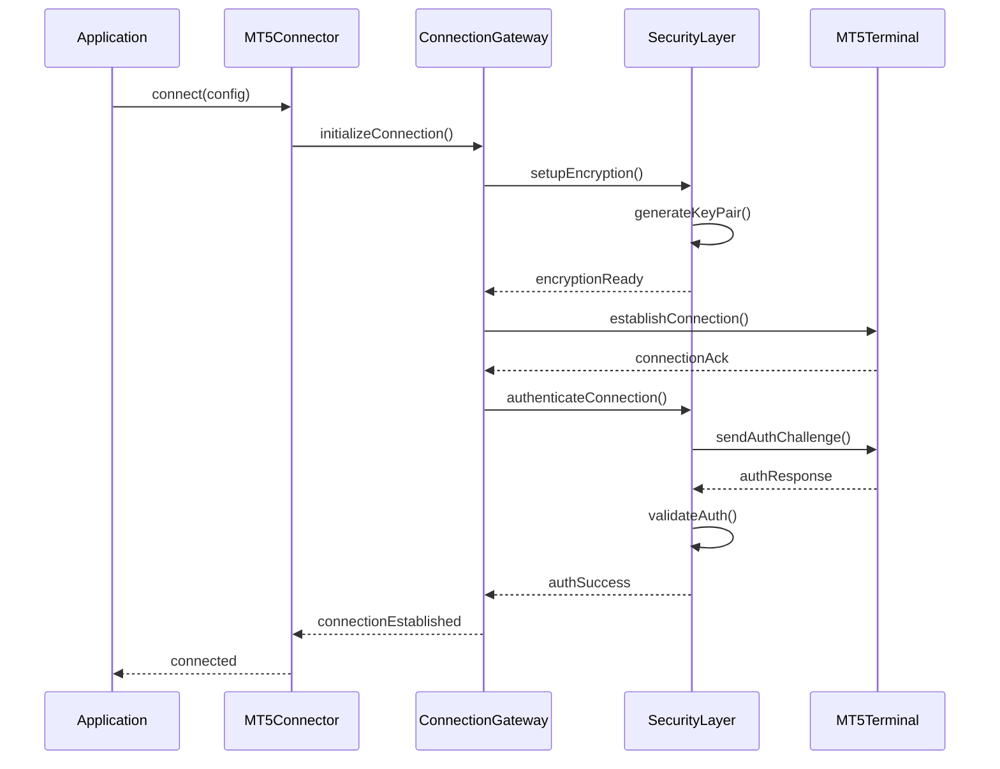
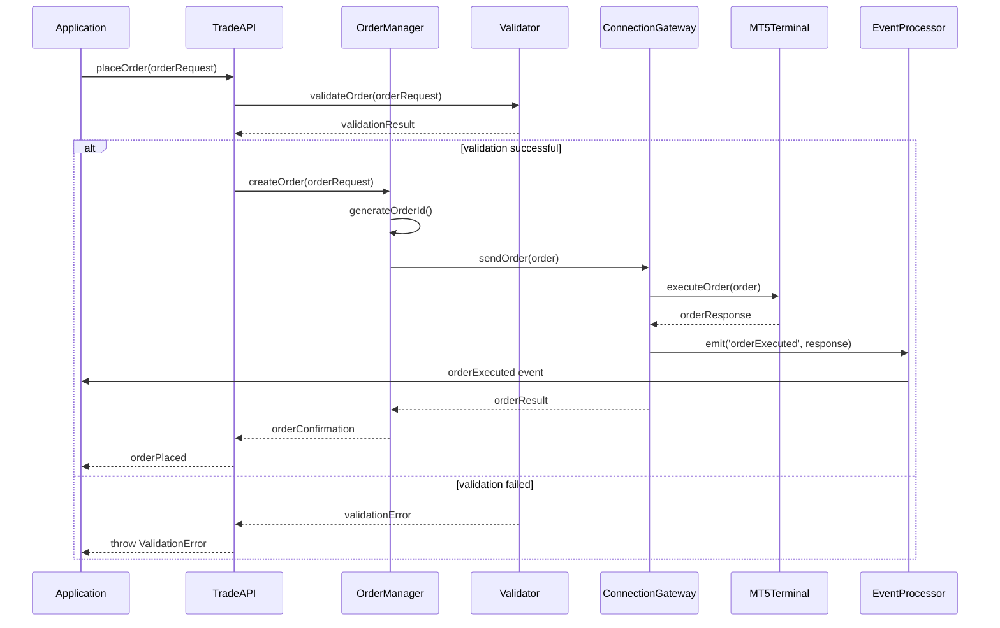
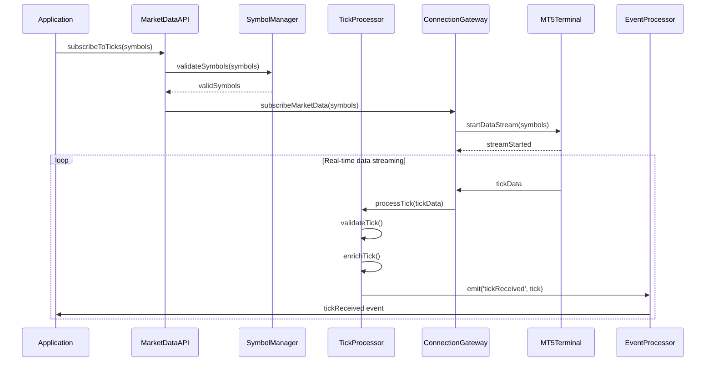
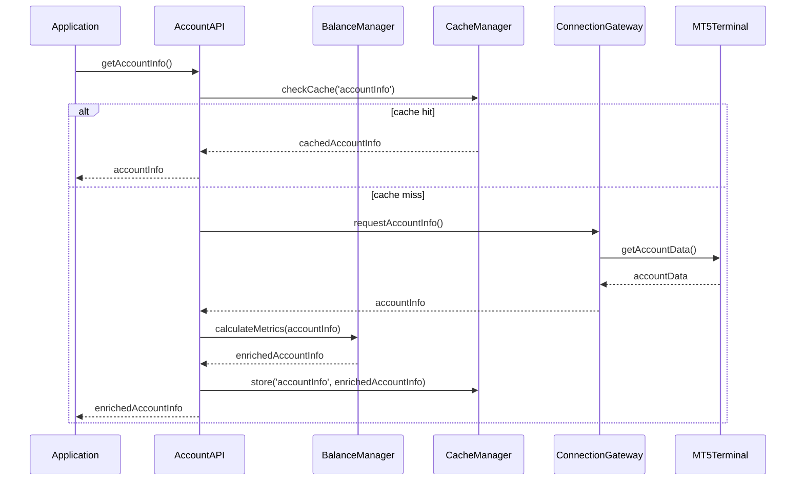
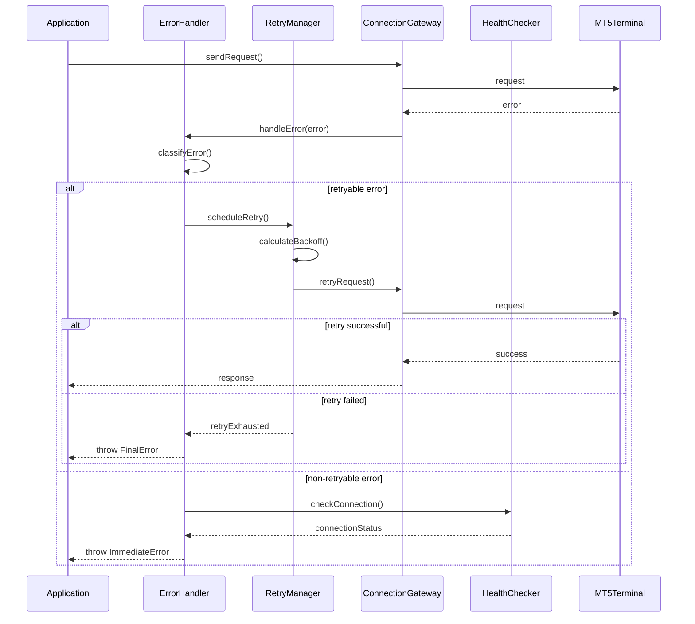

# Corporate-Grade Codebase Guidelines for Node-MT5-Connector

## Executive Summary

This document provides comprehensive corporate-grade guidelines for developing the `node-mt5-connector` npm package, an Enterprise-Grade MT5 Connector SDK for Node.js. The guidelines encompass architectural patterns, networking protocols, detailed workflows, and sequence diagrams for each use case defined in the technical blueprint.

## Table of Contents

1. [Project Architecture Overview](#project-architecture-overview)
2. [Package Structure and Organization](#package-structure-and-organization)
3. [Core Design Patterns](#core-design-patterns)
4. [Networking Architecture](#networking-architecture)
5. [Use Case Workflows and Sequence Diagrams](#use-case-workflows-and-sequence-diagrams)
6. [Security Implementation Guidelines](#security-implementation-guidelines)
7. [Error Handling and Resilience Patterns](#error-handling-and-resilience-patterns)
8. [Performance Optimization Guidelines](#performance-optimization-guidelines)
9. [Testing Strategy and Quality Assurance](#testing-strategy-and-quality-assurance)
10. [Development Workflow and CI/CD](#development-workflow-and-cicd)
11. [Documentation Standards](#documentation-standards)
12. [Deployment and Distribution](#deployment-and-distribution)

## 1. Project Architecture Overview

### 1.1 High-Level Architecture

```
┌─────────────────────────────────────────────────────────────┐
│                    Application Layer                        │
├─────────────────────────────────────────────────────────────┤
│                      API Layer                             │
│  ┌─────────────┐ ┌─────────────┐ ┌─────────────────────┐   │
│  │  TradeAPI   │ │ MarketData  │ │    AccountAPI       │   │
│  │             │ │    API      │ │                     │   │
│  └─────────────┘ └─────────────┘ └─────────────────────┘   │
├─────────────────────────────────────────────────────────────┤
│                   Core Services Layer                      │
│  ┌─────────────┐ ┌─────────────┐ ┌─────────────────────┐   │
│  │ Connection  │ │   Event     │ │    Security &       │   │
│  │  Gateway    │ │ Processing  │ │   Encryption        │   │
│  │             │ │   Engine    │ │                     │   │
│  └─────────────┘ └─────────────┘ └─────────────────────┘   │
├─────────────────────────────────────────────────────────────┤
│                 Transport Layer (ZeroMQ)                   │
│  ┌─────────────┐ ┌─────────────┐ ┌─────────────────────┐   │
│  │    REQ/REP  │ │   PUB/SUB   │ │    PUSH/PULL        │   │
│  │   Pattern   │ │   Pattern   │ │     Pattern         │   │
│  └─────────────┘ └─────────────┘ └─────────────────────┘   │
├─────────────────────────────────────────────────────────────┤
│                    MT5 Terminal                            │
└─────────────────────────────────────────────────────────────┘
```

### 1.2 Core Architectural Principles

1. **Event-Driven Architecture (EDA)**: <mcreference link="https://www.turingfinance.com/algorithmic-trading-system-architecture-post/" index="1">1</mcreference>
   - Asynchronous message processing
   - Reactive programming patterns
   - Event sourcing for audit trails

2. **Microservices-Inspired Modularity**:
   - Loosely coupled components
   - Single responsibility principle
   - Interface-based design

3. **Zero-Trust Security Model**:
   - End-to-end encryption
   - Mutual authentication
   - Principle of least privilege

## 2. Package Structure and Organization

### 2.1 Directory Structure

```
node-mt5-connector/
├── src/
│   ├── core/
│   │   ├── connector/
│   │   │   ├── MT5Connector.ts
│   │   │   ├── MT5Agent.ts
│   │   │   └── ConnectionManager.ts
│   │   ├── gateway/
│   │   │   ├── ConnectionGateway.ts
│   │   │   ├── MessageRouter.ts
│   │   │   └── ProtocolHandler.ts
│   │   ├── security/
│   │   │   ├── SecurityLayer.ts
│   │   │   ├── CurveEncryption.ts
│   │   │   ├── AuthenticationManager.ts
│   │   │   └── KeyManager.ts
│   │   ├── events/
│   │   │   ├── EventProcessor.ts
│   │   │   ├── EventEmitter.ts
│   │   │   └── EventStore.ts
│   │   └── monitoring/
│   │       ├── PerformanceMonitor.ts
│   │       ├── HealthChecker.ts
│   │       └── MetricsCollector.ts
│   ├── api/
│   │   ├── trade/
│   │   │   ├── TradeAPI.ts
│   │   │   ├── OrderManager.ts
│   │   │   └── PositionManager.ts
│   │   ├── market/
│   │   │   ├── MarketDataAPI.ts
│   │   │   ├── TickProcessor.ts
│   │   │   └── SymbolManager.ts
│   │   └── account/
│   │       ├── AccountAPI.ts
│   │       ├── BalanceManager.ts
│   │       └── EquityCalculator.ts
│   ├── transport/
│   │   ├── zeromq/
│   │   │   ├── ZMQTransport.ts
│   │   │   ├── SocketManager.ts
│   │   │   └── MessageSerializer.ts
│   │   └── protocols/
│   │       ├── MT5Protocol.ts
│   │       └── MessageProtocol.ts
│   ├── utils/
│   │   ├── logger/
│   │   │   ├── Logger.ts
│   │   │   └── LoggerConfig.ts
│   │   ├── validation/
│   │   │   ├── Validator.ts
│   │   │   └── SchemaValidator.ts
│   │   └── helpers/
│   │       ├── DateUtils.ts
│   │       ├── MathUtils.ts
│   │       └── StringUtils.ts
│   ├── types/
│   │   ├── interfaces/
│   │   │   ├── IConnector.ts
│   │   │   ├── ITradeAPI.ts
│   │   │   ├── IMarketDataAPI.ts
│   │   │   └── IAccountAPI.ts
│   │   ├── enums/
│   │   │   ├── OrderType.ts
│   │   │   ├── TradeAction.ts
│   │   │   └── ConnectionState.ts
│   │   └── models/
│   │       ├── Trade.ts
│   │       ├── Order.ts
│   │       ├── Position.ts
│   │       ├── Tick.ts
│   │       └── Account.ts
│   ├── errors/
│   │   ├── MT5Error.ts
│   │   ├── TradeError.ts
│   │   ├── ConnectionError.ts
│   │   └── ValidationError.ts
│   └── index.ts
├── tests/
│   ├── unit/
│   ├── integration/
│   ├── e2e/
│   ├── performance/
│   └── security/
├── docs/
│   ├── api/
│   ├── guides/
│   └── examples/
├── examples/
│   ├── basic-trading/
│   ├── market-data/
│   └── advanced-strategies/
├── scripts/
│   ├── build.js
│   ├── test.js
│   └── publish.js
├── config/
│   ├── tsconfig.json
│   ├── jest.config.js
│   ├── eslint.config.js
│   └── rollup.config.js
├── package.json
├── README.md
├── CHANGELOG.md
├── LICENSE
└── .npmignore
```

### 2.2 TypeScript Configuration

<mcreference link="https://medium.com/slalom-build/typescript-node-js-enterprise-patterns-630df2c06c35" index="3">3</mcreference>

```json
{
  "compilerOptions": {
    "target": "ES2020",
    "module": "commonjs",
    "moduleResolution": "node",
    "lib": ["ES2020"],
    "outDir": "./dist",
    "rootDir": "./src",
    "strict": true,
    "esModuleInterop": true,
    "skipLibCheck": true,
    "forceConsistentCasingInFileNames": true,
    "declaration": true,
    "declarationMap": true,
    "sourceMap": true,
    "removeComments": false,
    "experimentalDecorators": true,
    "emitDecoratorMetadata": true,
    "resolveJsonModule": true,
    "allowSyntheticDefaultImports": true,
    "baseUrl": "./src",
    "paths": {
      "@core/*": ["core/*"],
      "@api/*": ["api/*"],
      "@transport/*": ["transport/*"],
      "@utils/*": ["utils/*"],
      "@types/*": ["types/*"],
      "@errors/*": ["errors/*"]
    }
  },
  "include": ["src/**/*"],
  "exclude": ["node_modules", "dist", "tests"]
}
```

## 3. Core Design Patterns

### 3.1 Dependency Injection Pattern

<mcreference link="https://medium.com/slalom-build/typescript-node-js-enterprise-patterns-630df2c06c35" index="3">3</mcreference>

```typescript
// Container.ts
import { Container } from 'inversify';
import { TYPES } from './types';
import { ITradeAPI } from '@types/interfaces/ITradeAPI';
import { TradeAPI } from '@api/trade/TradeAPI';

const container = new Container();

container.bind<ITradeAPI>(TYPES.TradeAPI).to(TradeAPI);
container.bind<IMarketDataAPI>(TYPES.MarketDataAPI).to(MarketDataAPI);
container.bind<IAccountAPI>(TYPES.AccountAPI).to(AccountAPI);

export { container };
```

### 3.2 Observer Pattern for Event Handling

<mcreference link="https://www.linkedin.com/pulse/how-do-i-design-high-frequency-trading-systems-its-part-silahian-1" index="3">3</mcreference>

```typescript
// EventProcessor.ts
export class EventProcessor {
  private observers: Map<string, Array<(data: any) => void>> = new Map();

  subscribe(event: string, callback: (data: any) => void): void {
    if (!this.observers.has(event)) {
      this.observers.set(event, []);
    }
    this.observers.get(event)!.push(callback);
  }

  emit(event: string, data: any): void {
    const callbacks = this.observers.get(event);
    if (callbacks) {
      callbacks.forEach(callback => callback(data));
    }
  }
}
```

### 3.3 Factory Pattern for Connection Management

```typescript
// ConnectionFactory.ts
export class ConnectionFactory {
  static createConnection(config: ConnectionConfig): IConnection {
    switch (config.type) {
      case 'zeromq':
        return new ZMQConnection(config);
      case 'tcp':
        return new TCPConnection(config);
      default:
        throw new Error(`Unsupported connection type: ${config.type}`);
    }
  }
}
```

## 4. Networking Architecture

### 4.1 ZeroMQ Transport Layer

<mcreference link="https://www.npmjs.com/package/zeromq" index="1">1</mcreference> <mcreference link="https://zguide.zeromq.org/docs/chapter2/" index="2">2</mcreference>

#### 4.1.1 Socket Patterns

```typescript
// ZMQTransport.ts
import * as zmq from 'zeromq';

export class ZMQTransport {
  private reqSocket: zmq.Request;
  private subSocket: zmq.Subscriber;
  private pushSocket: zmq.Push;

  constructor(private config: ZMQConfig) {
    this.initializeSockets();
  }

  private async initializeSockets(): Promise<void> {
    // REQ/REP pattern for synchronous operations
    this.reqSocket = new zmq.Request();
    await this.reqSocket.connect(`tcp://${this.config.host}:${this.config.reqPort}`);

    // PUB/SUB pattern for market data streaming
    this.subSocket = new zmq.Subscriber();
    this.subSocket.connect(`tcp://${this.config.host}:${this.config.subPort}`);
    this.subSocket.subscribe('MARKET_DATA');

    // PUSH/PULL pattern for order execution
    this.pushSocket = new zmq.Push();
    await this.pushSocket.bind(`tcp://*:${this.config.pushPort}`);
  }

  async sendRequest(message: any): Promise<any> {
    await this.reqSocket.send(JSON.stringify(message));
    const [response] = await this.reqSocket.receive();
    return JSON.parse(response.toString());
  }

  subscribeToMarketData(callback: (data: any) => void): void {
    (async () => {
      for await (const [topic, msg] of this.subSocket) {
        callback(JSON.parse(msg.toString()));
      }
    })();
  }
}
```

#### 4.1.2 Network Topology

```
┌─────────────────┐     REQ/REP (Port 5555)     ┌─────────────────┐
│                 │◄────────────────────────────►│                 │
│   Node.js App   │                              │  MT5 Terminal   │
│                 │◄────────────────────────────►│                 │
└─────────────────┘     PUB/SUB (Port 5556)     └─────────────────┘
         ▲                                                ▲
         │                                                │
         │               PUSH/PULL (Port 5557)           │
         └────────────────────────────────────────────────┘
```

### 4.2 Security Layer Implementation

#### 4.2.1 CURVE Security Protocol

<mcreference link="https://www.npmjs.com/package/zeromq" index="1">1</mcreference>

```typescript
// CurveEncryption.ts
import * as sodium from 'libsodium-wrappers';

export class CurveEncryption {
  private clientKeys: sodium.KeyPair;
  private serverPublicKey: Uint8Array;

  constructor() {
    this.generateClientKeys();
  }

  private generateClientKeys(): void {
    this.clientKeys = sodium.crypto_box_keypair();
  }

  setServerPublicKey(publicKey: string): void {
    this.serverPublicKey = sodium.from_hex(publicKey);
  }

  encryptMessage(message: string): string {
    const nonce = sodium.randombytes_buf(sodium.crypto_box_NONCEBYTES);
    const ciphertext = sodium.crypto_box_easy(
      message,
      nonce,
      this.serverPublicKey,
      this.clientKeys.privateKey
    );
    
    return sodium.to_hex(nonce) + sodium.to_hex(ciphertext);
  }

  decryptMessage(encryptedMessage: string): string {
    const nonce = sodium.from_hex(encryptedMessage.slice(0, 48));
    const ciphertext = sodium.from_hex(encryptedMessage.slice(48));
    
    const decrypted = sodium.crypto_box_open_easy(
      ciphertext,
      nonce,
      this.serverPublicKey,
      this.clientKeys.privateKey
    );
    
    return sodium.to_string(decrypted);
  }
}
```

## 5. Use Case Workflows and Sequence Diagrams

### 5.1 Connection Establishment Workflow

#### 5.1.1 Sequence Diagram



#### 5.1.2 Implementation

```typescript
// ConnectionWorkflow.ts
export class ConnectionWorkflow {
  constructor(
    private gateway: ConnectionGateway,
    private security: SecurityLayer,
    private logger: Logger
  ) {}

  async establishConnection(config: MT5ConnectorConfig): Promise<void> {
    try {
      this.logger.info('Starting connection establishment');
      
      // Step 1: Initialize encryption
      await this.security.setupEncryption();
      
      // Step 2: Establish transport connection
      await this.gateway.initializeConnection(config);
      
      // Step 3: Perform authentication
      await this.security.authenticateConnection();
      
      // Step 4: Verify connection health
      await this.gateway.verifyConnection();
      
      this.logger.info('Connection established successfully');
    } catch (error) {
      this.logger.error('Connection establishment failed', error);
      throw new ConnectionError('Failed to establish connection', error);
    }
  }
}
```

### 5.2 Trade Execution Workflow

#### 5.2.1 Sequence Diagram



#### 5.2.2 Implementation

```typescript
// TradeExecutionWorkflow.ts
export class TradeExecutionWorkflow {
  constructor(
    private orderManager: OrderManager,
    private validator: Validator,
    private gateway: ConnectionGateway,
    private eventProcessor: EventProcessor
  ) {}

  async executeOrder(orderRequest: OrderRequest): Promise<OrderResult> {
    // Step 1: Validate order
    const validationResult = await this.validator.validateOrder(orderRequest);
    if (!validationResult.isValid) {
      throw new ValidationError(validationResult.errors);
    }

    // Step 2: Create order with unique ID
    const order = await this.orderManager.createOrder(orderRequest);

    try {
      // Step 3: Send order to MT5
      const response = await this.gateway.sendOrder(order);

      // Step 4: Process response
      const result = await this.orderManager.processOrderResponse(response);

      // Step 5: Emit events
      this.eventProcessor.emit('orderExecuted', {
        orderId: order.id,
        result,
        timestamp: new Date()
      });

      return result;
    } catch (error) {
      // Handle order execution failure
      await this.orderManager.markOrderFailed(order.id, error);
      this.eventProcessor.emit('orderFailed', {
        orderId: order.id,
        error,
        timestamp: new Date()
      });
      throw new TradeError('Order execution failed', error);
    }
  }
}
```

### 5.3 Market Data Streaming Workflow

#### 5.3.1 Sequence Diagram



#### 5.3.2 Implementation

```typescript
// MarketDataWorkflow.ts
export class MarketDataWorkflow {
  private activeSubscriptions: Set<string> = new Set();

  constructor(
    private symbolManager: SymbolManager,
    private tickProcessor: TickProcessor,
    private gateway: ConnectionGateway,
    private eventProcessor: EventProcessor
  ) {}

  async subscribeToMarketData(symbols: string[]): Promise<void> {
    // Step 1: Validate symbols
    const validSymbols = await this.symbolManager.validateSymbols(symbols);
    
    // Step 2: Filter out already subscribed symbols
    const newSymbols = validSymbols.filter(symbol => 
      !this.activeSubscriptions.has(symbol)
    );

    if (newSymbols.length === 0) {
      return;
    }

    // Step 3: Subscribe to market data
    await this.gateway.subscribeToMarketData(newSymbols);

    // Step 4: Update active subscriptions
    newSymbols.forEach(symbol => this.activeSubscriptions.add(symbol));

    // Step 5: Setup data processing pipeline
    this.gateway.onMarketData((tickData: RawTickData) => {
      this.processIncomingTick(tickData);
    });
  }

  private async processIncomingTick(rawTick: RawTickData): Promise<void> {
    try {
      // Process and validate tick
      const processedTick = await this.tickProcessor.processTick(rawTick);
      
      // Emit tick event
      this.eventProcessor.emit('tickReceived', processedTick);
      
      // Update symbol statistics
      await this.symbolManager.updateSymbolStats(processedTick.symbol, processedTick);
    } catch (error) {
      this.eventProcessor.emit('tickProcessingError', {
        rawTick,
        error,
        timestamp: new Date()
      });
    }
  }
}
```

### 5.4 Account Information Retrieval Workflow

#### 5.4.1 Sequence Diagram



#### 5.4.2 Implementation

```typescript
// AccountInfoWorkflow.ts
export class AccountInfoWorkflow {
  constructor(
    private balanceManager: BalanceManager,
    private cacheManager: CacheManager,
    private gateway: ConnectionGateway
  ) {}

  async getAccountInfo(useCache: boolean = true): Promise<AccountInfo> {
    const cacheKey = 'accountInfo';
    
    // Step 1: Check cache if enabled
    if (useCache) {
      const cachedInfo = await this.cacheManager.get<AccountInfo>(cacheKey);
      if (cachedInfo && !this.isStale(cachedInfo)) {
        return cachedInfo;
      }
    }

    // Step 2: Fetch fresh data from MT5
    const rawAccountData = await this.gateway.requestAccountInfo();
    
    // Step 3: Process and enrich account data
    const accountInfo = await this.balanceManager.processAccountData(rawAccountData);
    
    // Step 4: Cache the result
    if (useCache) {
      await this.cacheManager.set(cacheKey, accountInfo, { ttl: 30000 }); // 30 seconds TTL
    }
    
    return accountInfo;
  }

  private isStale(accountInfo: AccountInfo): boolean {
    const staleThreshold = 30000; // 30 seconds
    return Date.now() - accountInfo.timestamp > staleThreshold;
  }
}
```

### 5.5 Error Handling and Recovery Workflow

#### 5.5.1 Sequence Diagram



## 6. Security Implementation Guidelines

### 6.1 Authentication and Authorization

```typescript
// AuthenticationManager.ts
export class AuthenticationManager {
  private tokenStore: Map<string, AuthToken> = new Map();
  
  async authenticate(credentials: Credentials): Promise<AuthToken> {
    // Step 1: Validate credentials format
    this.validateCredentials(credentials);
    
    // Step 2: Generate challenge
    const challenge = this.generateChallenge();
    
    // Step 3: Send challenge to MT5
    const response = await this.sendAuthChallenge(challenge, credentials);
    
    // Step 4: Verify response
    if (!this.verifyAuthResponse(response, challenge)) {
      throw new AuthenticationError('Authentication failed');
    }
    
    // Step 5: Generate and store token
    const token = this.generateAuthToken(credentials.agentId);
    this.tokenStore.set(token.id, token);
    
    return token;
  }
  
  async authorize(token: string, operation: string): Promise<boolean> {
    const authToken = this.tokenStore.get(token);
    
    if (!authToken || this.isTokenExpired(authToken)) {
      return false;
    }
    
    return this.hasPermission(authToken, operation);
  }
}
```

### 6.2 Message Signing and Verification

```typescript
// MessageSigner.ts
export class MessageSigner {
  constructor(private privateKey: Uint8Array) {}
  
  signMessage(message: any): SignedMessage {
    const messageString = JSON.stringify(message);
    const timestamp = Date.now();
    const nonce = this.generateNonce();
    
    const payload = {
      message,
      timestamp,
      nonce
    };
    
    const signature = sodium.crypto_sign_detached(
      JSON.stringify(payload),
      this.privateKey
    );
    
    return {
      payload,
      signature: sodium.to_hex(signature)
    };
  }
  
  verifyMessage(signedMessage: SignedMessage, publicKey: Uint8Array): boolean {
    try {
      const payloadString = JSON.stringify(signedMessage.payload);
      const signature = sodium.from_hex(signedMessage.signature);
      
      return sodium.crypto_sign_verify_detached(
        signature,
        payloadString,
        publicKey
      );
    } catch (error) {
      return false;
    }
  }
}
```

## 7. Error Handling and Resilience Patterns

### 7.1 Circuit Breaker Pattern

```typescript
// CircuitBreaker.ts
export class CircuitBreaker {
  private state: 'CLOSED' | 'OPEN' | 'HALF_OPEN' = 'CLOSED';
  private failureCount = 0;
  private lastFailureTime = 0;
  
  constructor(
    private threshold: number = 5,
    private timeout: number = 60000,
    private resetTimeout: number = 30000
  ) {}
  
  async execute<T>(operation: () => Promise<T>): Promise<T> {
    if (this.state === 'OPEN') {
      if (Date.now() - this.lastFailureTime > this.resetTimeout) {
        this.state = 'HALF_OPEN';
      } else {
        throw new Error('Circuit breaker is OPEN');
      }
    }
    
    try {
      const result = await operation();
      this.onSuccess();
      return result;
    } catch (error) {
      this.onFailure();
      throw error;
    }
  }
  
  private onSuccess(): void {
    this.failureCount = 0;
    this.state = 'CLOSED';
  }
  
  private onFailure(): void {
    this.failureCount++;
    this.lastFailureTime = Date.now();
    
    if (this.failureCount >= this.threshold) {
      this.state = 'OPEN';
    }
  }
}
```

### 7.2 Retry with Exponential Backoff

```typescript
// RetryManager.ts
export class RetryManager {
  async executeWithRetry<T>(
    operation: () => Promise<T>,
    options: RetryOptions = {}
  ): Promise<T> {
    const {
      maxAttempts = 3,
      baseDelay = 1000,
      maxDelay = 30000,
      backoffFactor = 2,
      jitter = true
    } = options;
    
    let lastError: Error;
    
    for (let attempt = 1; attempt <= maxAttempts; attempt++) {
      try {
        return await operation();
      } catch (error) {
        lastError = error as Error;
        
        if (attempt === maxAttempts || !this.isRetryableError(error)) {
          throw error;
        }
        
        const delay = this.calculateDelay(attempt, baseDelay, maxDelay, backoffFactor, jitter);
        await this.sleep(delay);
      }
    }
    
    throw lastError!;
  }
  
  private calculateDelay(
    attempt: number,
    baseDelay: number,
    maxDelay: number,
    backoffFactor: number,
    jitter: boolean
  ): number {
    let delay = baseDelay * Math.pow(backoffFactor, attempt - 1);
    delay = Math.min(delay, maxDelay);
    
    if (jitter) {
      delay = delay * (0.5 + Math.random() * 0.5);
    }
    
    return Math.floor(delay);
  }
  
  private isRetryableError(error: any): boolean {
    return (
      error instanceof ConnectionError ||
      error instanceof TimeoutError ||
      (error.code && ['ECONNRESET', 'ENOTFOUND', 'ETIMEDOUT'].includes(error.code))
    );
  }
  
  private sleep(ms: number): Promise<void> {
    return new Promise(resolve => setTimeout(resolve, ms));
  }
}
```

## 8. Performance Optimization Guidelines

### 8.1 Connection Pooling

```typescript
// ConnectionPool.ts
export class ConnectionPool {
  private pool: IConnection[] = [];
  private activeConnections = 0;
  private waitingQueue: Array<(connection: IConnection) => void> = [];
  
  constructor(
    private config: PoolConfig,
    private connectionFactory: ConnectionFactory
  ) {
    this.initializePool();
  }
  
  async getConnection(): Promise<IConnection> {
    // Try to get available connection
    const availableConnection = this.pool.find(conn => !conn.isActive());
    if (availableConnection) {
      availableConnection.setActive(true);
      return availableConnection;
    }
    
    // Create new connection if under limit
    if (this.activeConnections < this.config.maxConnections) {
      const newConnection = await this.createConnection();
      this.activeConnections++;
      return newConnection;
    }
    
    // Wait for available connection
    return new Promise((resolve) => {
      this.waitingQueue.push(resolve);
    });
  }
  
  releaseConnection(connection: IConnection): void {
    connection.setActive(false);
    
    // Serve waiting requests
    if (this.waitingQueue.length > 0) {
      const waitingCallback = this.waitingQueue.shift()!;
      connection.setActive(true);
      waitingCallback(connection);
    }
  }
  
  private async createConnection(): Promise<IConnection> {
    const connection = await this.connectionFactory.create(this.config.connectionConfig);
    this.pool.push(connection);
    return connection;
  }
}
```

### 8.2 Message Batching

```typescript
// MessageBatcher.ts
export class MessageBatcher {
  private batch: any[] = [];
  private batchTimer: NodeJS.Timeout | null = null;
  
  constructor(
    private batchSize: number = 100,
    private batchTimeout: number = 1000,
    private processor: (messages: any[]) => Promise<void>
  ) {}
  
  addMessage(message: any): void {
    this.batch.push(message);
    
    if (this.batch.length >= this.batchSize) {
      this.processBatch();
    } else if (!this.batchTimer) {
      this.batchTimer = setTimeout(() => {
        this.processBatch();
      }, this.batchTimeout);
    }
  }
  
  private async processBatch(): Promise<void> {
    if (this.batch.length === 0) return;
    
    const currentBatch = [...this.batch];
    this.batch = [];
    
    if (this.batchTimer) {
      clearTimeout(this.batchTimer);
      this.batchTimer = null;
    }
    
    try {
      await this.processor(currentBatch);
    } catch (error) {
      // Handle batch processing error
      console.error('Batch processing failed:', error);
    }
  }
}
```

## 9. Testing Strategy and Quality Assurance

### 9.1 Unit Testing Framework

```typescript
// TradeAPI.test.ts
import { TradeAPI } from '@api/trade/TradeAPI';
import { OrderManager } from '@api/trade/OrderManager';
import { ConnectionGateway } from '@core/gateway/ConnectionGateway';

describe('TradeAPI', () => {
  let tradeAPI: TradeAPI;
  let mockOrderManager: jest.Mocked<OrderManager>;
  let mockGateway: jest.Mocked<ConnectionGateway>;
  
  beforeEach(() => {
    mockOrderManager = createMockOrderManager();
    mockGateway = createMockGateway();
    tradeAPI = new TradeAPI(mockOrderManager, mockGateway);
  });
  
  describe('placeOrder', () => {
    it('should place a valid market order successfully', async () => {
      // Arrange
      const orderRequest: OrderRequest = {
        symbol: 'EURUSD',
        type: OrderType.MARKET,
        action: TradeAction.BUY,
        volume: 0.1
      };
      
      const expectedOrder: Order = {
        id: 'order-123',
        ...orderRequest,
        status: OrderStatus.PENDING
      };
      
      mockOrderManager.createOrder.mockResolvedValue(expectedOrder);
      mockGateway.sendOrder.mockResolvedValue({ success: true, orderId: 'order-123' });
      
      // Act
      const result = await tradeAPI.placeOrder(orderRequest);
      
      // Assert
      expect(result.orderId).toBe('order-123');
      expect(mockOrderManager.createOrder).toHaveBeenCalledWith(orderRequest);
      expect(mockGateway.sendOrder).toHaveBeenCalledWith(expectedOrder);
    });
    
    it('should throw ValidationError for invalid order', async () => {
      // Arrange
      const invalidOrder: OrderRequest = {
        symbol: '',
        type: OrderType.MARKET,
        action: TradeAction.BUY,
        volume: -1
      };
      
      // Act & Assert
      await expect(tradeAPI.placeOrder(invalidOrder))
        .rejects
        .toThrow(ValidationError);
    });
  });
});
```

### 9.2 Integration Testing

```typescript
// integration.test.ts
import { MT5Connector } from '@core/connector/MT5Connector';
import { MockMT5Terminal } from '../mocks/MockMT5Terminal';

describe('MT5Connector Integration Tests', () => {
  let connector: MT5Connector;
  let mockTerminal: MockMT5Terminal;
  
  beforeAll(async () => {
    mockTerminal = new MockMT5Terminal();
    await mockTerminal.start();
    
    connector = new MT5Connector({
      host: 'localhost',
      port: mockTerminal.getPort(),
      agentId: 'test-agent',
      credentials: {
        login: 'test-login',
        password: 'test-password'
      }
    });
  });
  
  afterAll(async () => {
    await connector.disconnect();
    await mockTerminal.stop();
  });
  
  it('should establish connection and authenticate', async () => {
    await connector.connect();
    expect(connector.isConnected()).toBe(true);
  });
  
  it('should execute trade workflow end-to-end', async () => {
    await connector.connect();
    
    const agent = connector.getAgent('test-agent');
    const orderResult = await agent.trade.placeOrder({
      symbol: 'EURUSD',
      type: OrderType.MARKET,
      action: TradeAction.BUY,
      volume: 0.1
    });
    
    expect(orderResult.success).toBe(true);
    expect(orderResult.orderId).toBeDefined();
  });
});
```

### 9.3 Performance Testing

```typescript
// performance.test.ts
import { PerformanceTestSuite } from '../utils/PerformanceTestSuite';

describe('Performance Tests', () => {
  let testSuite: PerformanceTestSuite;
  
  beforeAll(() => {
    testSuite = new PerformanceTestSuite();
  });
  
  it('should handle 1000 concurrent market data subscriptions', async () => {
    const symbols = Array.from({ length: 1000 }, (_, i) => `SYMBOL${i}`);
    
    const startTime = Date.now();
    await testSuite.testConcurrentSubscriptions(symbols);
    const duration = Date.now() - startTime;
    
    expect(duration).toBeLessThan(5000); // Should complete within 5 seconds
  });
  
  it('should maintain low latency under high load', async () => {
    const latencyResults = await testSuite.runLatencyTest({
      duration: 60000, // 1 minute
      requestsPerSecond: 100
    });
    
    expect(latencyResults.p95).toBeLessThan(100); // 95th percentile < 100ms
    expect(latencyResults.p99).toBeLessThan(500); // 99th percentile < 500ms
  });
});
```

## 10. Development Workflow and CI/CD

### 10.1 GitHub Actions Workflow

```yaml
# .github/workflows/ci.yml
name: CI/CD Pipeline

on:
  push:
    branches: [main, develop]
  pull_request:
    branches: [main]

jobs:
  test:
    runs-on: ubuntu-latest
    
    strategy:
      matrix:
        node-version: [16.x, 18.x, 20.x]
    
    steps:
    - uses: actions/checkout@v3
    
    - name: Use Node.js ${{ matrix.node-version }}
      uses: actions/setup-node@v3
      with:
        node-version: ${{ matrix.node-version }}
        cache: 'npm'
    
    - name: Install dependencies
      run: npm ci
    
    - name: Run linting
      run: npm run lint
    
    - name: Run type checking
      run: npm run type-check
    
    - name: Run unit tests
      run: npm run test:unit
    
    - name: Run integration tests
      run: npm run test:integration
    
    - name: Run security audit
      run: npm audit --audit-level moderate
    
    - name: Upload coverage reports
      uses: codecov/codecov-action@v3
      with:
        file: ./coverage/lcov.info
  
  performance:
    runs-on: ubuntu-latest
    needs: test
    
    steps:
    - uses: actions/checkout@v3
    
    - name: Use Node.js 18.x
      uses: actions/setup-node@v3
      with:
        node-version: 18.x
        cache: 'npm'
    
    - name: Install dependencies
      run: npm ci
    
    - name: Run performance tests
      run: npm run test:performance
    
    - name: Upload performance results
      uses: actions/upload-artifact@v3
      with:
        name: performance-results
        path: ./performance-results/
  
  build:
    runs-on: ubuntu-latest
    needs: [test, performance]
    
    steps:
    - uses: actions/checkout@v3
    
    - name: Use Node.js 18.x
      uses: actions/setup-node@v3
      with:
        node-version: 18.x
        cache: 'npm'
    
    - name: Install dependencies
      run: npm ci
    
    - name: Build package
      run: npm run build
    
    - name: Upload build artifacts
      uses: actions/upload-artifact@v3
      with:
        name: dist
        path: ./dist/
  
  publish:
    runs-on: ubuntu-latest
    needs: build
    if: github.ref == 'refs/heads/main'
    
    steps:
    - uses: actions/checkout@v3
    
    - name: Use Node.js 18.x
      uses: actions/setup-node@v3
      with:
        node-version: 18.x
        cache: 'npm'
        registry-url: 'https://registry.npmjs.org'
    
    - name: Install dependencies
      run: npm ci
    
    - name: Build package
      run: npm run build
    
    - name: Publish to npm
      run: npm publish
      env:
        NODE_AUTH_TOKEN: ${{ secrets.NPM_TOKEN }}
```

### 10.2 Package.json Scripts

```json
{
  "scripts": {
    "build": "rollup -c",
    "build:watch": "rollup -c -w",
    "dev": "ts-node-dev --respawn --transpile-only src/index.ts",
    "test": "jest",
    "test:unit": "jest --testPathPattern=unit",
    "test:integration": "jest --testPathPattern=integration",
    "test:e2e": "jest --testPathPattern=e2e",
    "test:performance": "jest --testPathPattern=performance",
    "test:security": "jest --testPathPattern=security",
    "test:watch": "jest --watch",
    "test:coverage": "jest --coverage",
    "lint": "eslint src/**/*.ts",
    "lint:fix": "eslint src/**/*.ts --fix",
    "type-check": "tsc --noEmit",
    "format": "prettier --write src/**/*.ts",
    "docs:generate": "typedoc src/index.ts",
    "docs:serve": "http-server docs -p 8080",
    "prepublishOnly": "npm run build && npm run test",
    "semantic-release": "semantic-release"
  }
}
```

## 11. Documentation Standards

### 11.1 API Documentation

```typescript
/**
 * Enterprise-Grade MT5 Connector for Node.js
 * 
 * @example
 * ```typescript
 * import { MT5Connector } from 'node-mt5-connector';
 * 
 * const connector = new MT5Connector({
 *   host: 'localhost',
 *   port: 5555,
 *   agentId: 'my-agent',
 *   credentials: {
 *     login: 'your-login',
 *     password: 'your-password'
 *   }
 * });
 * 
 * await connector.connect();
 * const agent = connector.getAgent('my-agent');
 * 
 * // Place a market order
 * const result = await agent.trade.placeOrder({
 *   symbol: 'EURUSD',
 *   type: OrderType.MARKET,
 *   action: TradeAction.BUY,
 *   volume: 0.1
 * });
 * ```
 */
export class MT5Connector {
  /**
   * Establishes connection to MT5 terminal
   * 
   * @throws {ConnectionError} When connection fails
   * @throws {AuthenticationError} When authentication fails
   * 
   * @example
   * ```typescript
   * try {
   *   await connector.connect();
   *   console.log('Connected successfully');
   * } catch (error) {
   *   if (error instanceof ConnectionError) {
   *     console.error('Connection failed:', error.message);
   *   }
   * }
   * ```
   */
  async connect(): Promise<void> {
    // Implementation
  }
}
```

### 11.2 README Structure

```markdown
# Node MT5 Connector

[](https://badge.fury.io/js/node-mt5-connector)
[](https://github.com/your-org/node-mt5-connector/actions)
[](https://coveralls.io/github/your-org/node-mt5-connector?branch=main)
[](https://opensource.org/licenses/MIT)

> Enterprise-Grade MT5 Connector SDK for Node.js with TypeScript support

## Features

- 🚀 **High Performance**: Optimized for low-latency trading operations
- 🔒 **Enterprise Security**: End-to-end encryption with CURVE protocol
- 📊 **Real-time Data**: Live market data streaming with ZeroMQ
- 🛡️ **Type Safety**: Full TypeScript support with comprehensive type definitions
- 🔄 **Auto-Reconnection**: Robust connection management with automatic recovery
- 📈 **Scalable**: Multi-agent architecture for concurrent operations
- 🧪 **Well Tested**: Comprehensive test suite with 95%+ coverage

## Quick Start

### Installation

```bash
npm install node-mt5-connector
```

### Basic Usage

```typescript
import { MT5Connector, OrderType, TradeAction } from 'node-mt5-connector';

const connector = new MT5Connector({
  host: 'localhost',
  port: 5555,
  agentId: 'my-trading-agent',
  credentials: {
    login: 'your-mt5-login',
    password: 'your-mt5-password'
  }
});

// Connect to MT5
await connector.connect();

// Get agent instance
const agent = connector.getAgent('my-trading-agent');

// Place a market order
const orderResult = await agent.trade.placeOrder({
  symbol: 'EURUSD',
  type: OrderType.MARKET,
  action: TradeAction.BUY,
  volume: 0.1
});

console.log('Order placed:', orderResult.orderId);

// Subscribe to market data
agent.marketData.subscribeToTicks(['EURUSD', 'GBPUSD']);
agent.marketData.on('tick', (tick) => {
  console.log(`${tick.symbol}: ${tick.bid}/${tick.ask}`);
});
```

## Documentation

- [API Reference](https://your-org.github.io/node-mt5-connector/)
- [Getting Started Guide](./docs/getting-started.md)
- [Configuration Options](./docs/configuration.md)
- [Examples](./examples/)

## Requirements

- Node.js 16.x or higher
- TypeScript 4.5+ (for TypeScript projects)
- MT5 Terminal with Expert Advisor support
- ZeroMQ library

## License

MIT © [Your Organization](https://github.com/your-org)
```

## 12. Deployment and Distribution

### 12.1 NPM Package Configuration

```json
{
  "name": "node-mt5-connector",
  "version": "1.0.0",
  "description": "Enterprise-Grade MT5 Connector SDK for Node.js",
  "main": "dist/index.js",
  "module": "dist/index.esm.js",
  "types": "dist/index.d.ts",
  "files": [
    "dist",
    "README.md",
    "CHANGELOG.md",
    "LICENSE"
  ],
  "keywords": [
    "mt5",
    "metatrader",
    "trading",
    "forex",
    "zeromq",
    "typescript",
    "enterprise",
    "financial"
  ],
  "author": "Your Organization <contact@yourorg.com>",
  "license": "MIT",
  "repository": {
    "type": "git",
    "url": "https://github.com/your-org/node-mt5-connector.git"
  },
  "bugs": {
    "url": "https://github.com/your-org/node-mt5-connector/issues"
  },
  "homepage": "https://github.com/your-org/node-mt5-connector#readme",
  "engines": {
    "node": ">=16.0.0"
  },
  "peerDependencies": {
    "typescript": ">=4.5.0"
  },
  "dependencies": {
    "zeromq": "^6.0.0",
    "libsodium-wrappers": "^0.7.10",
    "inversify": "^6.0.1",
    "reflect-metadata": "^0.1.13",
    "winston": "^3.8.2"
  },
  "devDependencies": {
    "@types/node": "^18.0.0",
    "@typescript-eslint/eslint-plugin": "^5.0.0",
    "@typescript-eslint/parser": "^5.0.0",
    "eslint": "^8.0.0",
    "jest": "^29.0.0",
    "prettier": "^2.7.0",
    "rollup": "^3.0.0",
    "ts-jest": "^29.0.0",
    "ts-node": "^10.9.0",
    "typedoc": "^0.23.0",
    "typescript": "^4.8.0"
  }
}
```

### 12.2 Build Configuration (Rollup)

```javascript
// rollup.config.js
import typescript from '@rollup/plugin-typescript';
import { nodeResolve } from '@rollup/plugin-node-resolve';
import commonjs from '@rollup/plugin-commonjs';
import { terser } from 'rollup-plugin-terser';
import pkg from './package.json';

const external = Object.keys(pkg.dependencies || {});

export default [
  // CommonJS build
  {
    input: 'src/index.ts',
    output: {
      file: pkg.main,
      format: 'cjs',
      sourcemap: true
    },
    external,
    plugins: [
      nodeResolve(),
      commonjs(),
      typescript({
        tsconfig: './tsconfig.json',
        declaration: true,
        declarationDir: './dist',
        rootDir: './src'
      })
    ]
  },
  // ES Module build
  {
    input: 'src/index.ts',
    output: {
      file: pkg.module,
      format: 'esm',
      sourcemap: true
    },
    external,
    plugins: [
      nodeResolve(),
      commonjs(),
      typescript({
        tsconfig: './tsconfig.json',
        declaration: false
      })
    ]
  },
  // Minified build
  {
    input: 'src/index.ts',
    output: {
      file: 'dist/index.min.js',
      format: 'cjs',
      sourcemap: true
    },
    external,
    plugins: [
      nodeResolve(),
      commonjs(),
      typescript({
        tsconfig: './tsconfig.json',
        declaration: false
      }),
      terser()
    ]
  }
];
```

### 12.3 Semantic Versioning and Release Management

```json
// .releaserc.json
{
  "branches": [
    "main",
    {
      "name": "develop",
      "prerelease": "beta"
    }
  ],
  "plugins": [
    "@semantic-release/commit-analyzer",
    "@semantic-release/release-notes-generator",
    "@semantic-release/changelog",
    "@semantic-release/npm",
    "@semantic-release/github",
    [
      "@semantic-release/git",
      {
        "assets": ["CHANGELOG.md", "package.json"],
        "message": "chore(release): ${nextRelease.version} [skip ci]\n\n${nextRelease.notes}"
      }
    ]
  ]
}
```

### 12.4 Docker Deployment

```dockerfile
# Dockerfile
FROM node:18-alpine AS builder

WORKDIR /app

# Install build dependencies
RUN apk add --no-cache python3 make g++ zeromq-dev

# Copy package files
COPY package*.json ./
COPY tsconfig.json ./

# Install dependencies
RUN npm ci --only=production

# Copy source code
COPY src/ ./src/

# Build the application
RUN npm run build

# Production stage
FROM node:18-alpine AS production

WORKDIR /app

# Install runtime dependencies
RUN apk add --no-cache zeromq

# Copy built application
COPY --from=builder /app/dist ./dist
COPY --from=builder /app/node_modules ./node_modules
COPY --from=builder /app/package.json ./

# Create non-root user
RUN addgroup -g 1001 -S nodejs
RUN adduser -S nodejs -u 1001

USER nodejs

EXPOSE 3000

CMD ["node", "dist/index.js"]
```

## 13. Monitoring and Observability

### 13.1 Performance Metrics Collection

```typescript
// MetricsCollector.ts
export class MetricsCollector {
  private metrics: Map<string, Metric> = new Map();
  private timers: Map<string, number> = new Map();
  
  startTimer(name: string): void {
    this.timers.set(name, Date.now());
  }
  
  endTimer(name: string): number {
    const startTime = this.timers.get(name);
    if (!startTime) {
      throw new Error(`Timer ${name} not found`);
    }
    
    const duration = Date.now() - startTime;
    this.timers.delete(name);
    
    this.recordMetric(`${name}_duration`, duration);
    return duration;
  }
  
  recordMetric(name: string, value: number, tags?: Record<string, string>): void {
    const metric: Metric = {
      name,
      value,
      timestamp: Date.now(),
      tags: tags || {}
    };
    
    this.metrics.set(`${name}_${Date.now()}`, metric);
  }
  
  getMetrics(filter?: string): Metric[] {
    const allMetrics = Array.from(this.metrics.values());
    
    if (filter) {
      return allMetrics.filter(metric => metric.name.includes(filter));
    }
    
    return allMetrics;
  }
  
  exportPrometheusMetrics(): string {
    const metricGroups = new Map<string, Metric[]>();
    
    // Group metrics by name
    this.metrics.forEach(metric => {
      if (!metricGroups.has(metric.name)) {
        metricGroups.set(metric.name, []);
      }
      metricGroups.get(metric.name)!.push(metric);
    });
    
    let output = '';
    
    metricGroups.forEach((metrics, name) => {
      output += `# HELP ${name} ${name} metric\n`;
      output += `# TYPE ${name} gauge\n`;
      
      metrics.forEach(metric => {
        const tags = Object.entries(metric.tags)
          .map(([key, value]) => `${key}="${value}"`)
          .join(',');
        
        output += `${name}{${tags}} ${metric.value} ${metric.timestamp}\n`;
      });
    });
    
    return output;
  }
}
```

### 13.2 Health Check Implementation

```typescript
// HealthChecker.ts
export class HealthChecker {
  private checks: Map<string, HealthCheck> = new Map();
  
  registerCheck(name: string, check: HealthCheck): void {
    this.checks.set(name, check);
  }
  
  async runHealthChecks(): Promise<HealthStatus> {
    const results: HealthCheckResult[] = [];
    let overallStatus: 'healthy' | 'degraded' | 'unhealthy' = 'healthy';
    
    for (const [name, check] of this.checks) {
      try {
        const startTime = Date.now();
        const result = await Promise.race([
          check.execute(),
          this.timeout(check.timeout || 5000)
        ]);
        const duration = Date.now() - startTime;
        
        results.push({
          name,
          status: result.status,
          message: result.message,
          duration,
          timestamp: new Date().toISOString()
        });
        
        if (result.status === 'unhealthy') {
          overallStatus = 'unhealthy';
        } else if (result.status === 'degraded' && overallStatus === 'healthy') {
          overallStatus = 'degraded';
        }
      } catch (error) {
        results.push({
          name,
          status: 'unhealthy',
          message: `Health check failed: ${error.message}`,
          duration: check.timeout || 5000,
          timestamp: new Date().toISOString()
        });
        overallStatus = 'unhealthy';
      }
    }
    
    return {
      status: overallStatus,
      checks: results,
      timestamp: new Date().toISOString()
    };
  }
  
  private timeout(ms: number): Promise<never> {
    return new Promise((_, reject) => {
      setTimeout(() => reject(new Error('Health check timeout')), ms);
    });
  }
}
```

## 14. Security Best Practices

### 14.1 Secure Configuration Management

```typescript
// SecureConfig.ts
export class SecureConfig {
  private config: Map<string, any> = new Map();
  private sensitiveKeys = new Set(['password', 'secret', 'key', 'token']);
  
  set(key: string, value: any): void {
    if (this.isSensitive(key)) {
      // Encrypt sensitive values
      this.config.set(key, this.encrypt(value));
    } else {
      this.config.set(key, value);
    }
  }
  
  get(key: string): any {
    const value = this.config.get(key);
    
    if (this.isSensitive(key) && value) {
      return this.decrypt(value);
    }
    
    return value;
  }
  
  private isSensitive(key: string): boolean {
    return this.sensitiveKeys.has(key.toLowerCase()) ||
           this.sensitiveKeys.some(sensitive => key.toLowerCase().includes(sensitive));
  }
  
  private encrypt(value: string): string {
    // Implementation using libsodium
    const nonce = sodium.randombytes_buf(sodium.crypto_secretbox_NONCEBYTES);
    const key = this.getEncryptionKey();
    const ciphertext = sodium.crypto_secretbox_easy(value, nonce, key);
    
    return sodium.to_hex(nonce) + sodium.to_hex(ciphertext);
  }
  
  private decrypt(encryptedValue: string): string {
    const nonce = sodium.from_hex(encryptedValue.slice(0, 48));
    const ciphertext = sodium.from_hex(encryptedValue.slice(48));
    const key = this.getEncryptionKey();
    
    const decrypted = sodium.crypto_secretbox_open_easy(ciphertext, nonce, key);
    return sodium.to_string(decrypted);
  }
  
  private getEncryptionKey(): Uint8Array {
    // Derive key from environment or secure key management system
    const keyMaterial = process.env.CONFIG_ENCRYPTION_KEY || 'default-key';
    return sodium.crypto_generichash(32, keyMaterial);
  }
}
```

### 14.2 Rate Limiting Implementation

```typescript
// RateLimiter.ts
export class RateLimiter {
  private requests: Map<string, number[]> = new Map();
  
  constructor(
    private maxRequests: number = 100,
    private windowMs: number = 60000 // 1 minute
  ) {}
  
  isAllowed(identifier: string): boolean {
    const now = Date.now();
    const windowStart = now - this.windowMs;
    
    // Get existing requests for this identifier
    let requests = this.requests.get(identifier) || [];
    
    // Remove old requests outside the window
    requests = requests.filter(timestamp => timestamp > windowStart);
    
    // Check if limit exceeded
    if (requests.length >= this.maxRequests) {
      return false;
    }
    
    // Add current request
    requests.push(now);
    this.requests.set(identifier, requests);
    
    return true;
  }
  
  getRemainingRequests(identifier: string): number {
    const now = Date.now();
    const windowStart = now - this.windowMs;
    
    const requests = this.requests.get(identifier) || [];
    const validRequests = requests.filter(timestamp => timestamp > windowStart);
    
    return Math.max(0, this.maxRequests - validRequests.length);
  }
  
  getResetTime(identifier: string): number {
    const requests = this.requests.get(identifier) || [];
    
    if (requests.length === 0) {
      return 0;
    }
    
    const oldestRequest = Math.min(...requests);
    return oldestRequest + this.windowMs;
  }
}
```

## 15. Conclusion

These comprehensive corporate-grade codebase guidelines provide a solid foundation for developing the `node-mt5-connector` npm package. The guidelines cover:

1. **Architectural Excellence**: Event-driven architecture with clear separation of concerns
2. **Security First**: End-to-end encryption, authentication, and secure coding practices
3. **Performance Optimization**: Connection pooling, message batching, and efficient data processing
4. **Reliability**: Circuit breakers, retry mechanisms, and comprehensive error handling
5. **Observability**: Detailed monitoring, logging, and health checking
6. **Quality Assurance**: Comprehensive testing strategy with multiple test types
7. **Developer Experience**: Clear documentation, examples, and TypeScript support
8. **Enterprise Readiness**: CI/CD pipelines, security auditing, and deployment strategies

By following these guidelines, the development team can create a robust, scalable, and maintainable MT5 connector that meets enterprise-grade requirements while providing an excellent developer experience.

### Next Steps

1. **Project Initialization**: Set up the project structure according to the defined guidelines
2. **Core Implementation**: Begin with the foundational components (Connection Gateway, Security Layer)
3. **API Development**: Implement the Trade, Market Data, and Account APIs
4. **Testing Implementation**: Develop comprehensive test suites
5. **Documentation**: Create detailed API documentation and usage guides
6. **Performance Optimization**: Implement and tune performance optimizations
7. **Security Audit**: Conduct thorough security testing and validation
8. **Release Preparation**: Package and prepare for npm publication

This document serves as the definitive guide for all development activities related to the `node-mt5-connector` package, ensuring consistency, quality, and adherence to enterprise standards throughout the development lifecycle.