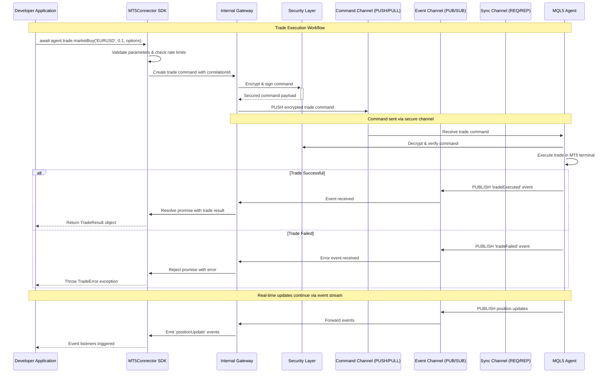
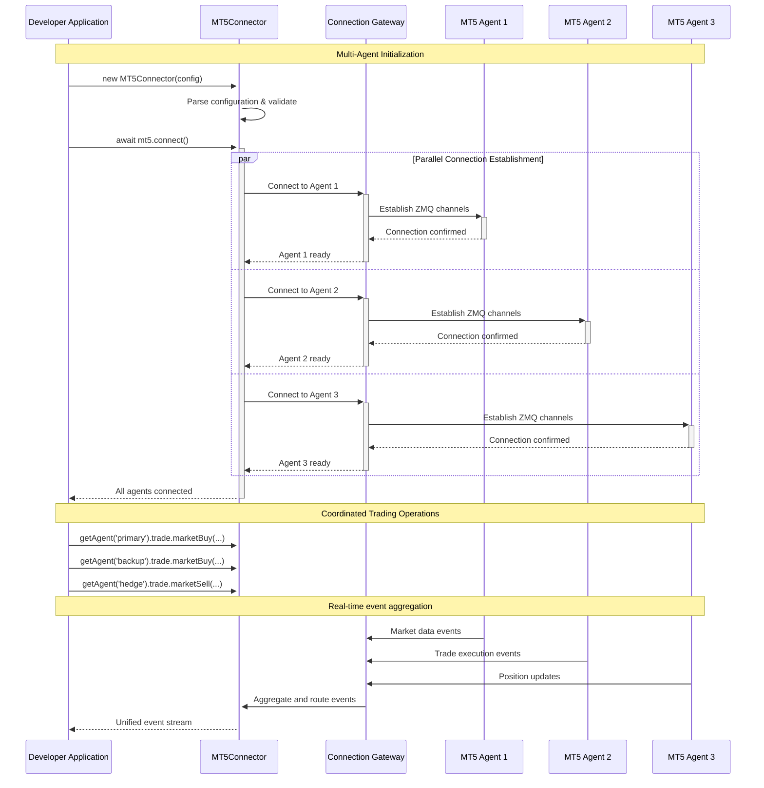

# PROMPT: Blueprint for an Enterprise-Grade, Pluggable MT5 Connector SDK

## Context & Role Definition

**Your Role:** You are a Principal Software Engineer and Developer Advocate with 15+ years of experience in financial technology. You specialize in creating developer-friendly APIs for complex trading systems and have successfully launched multiple NPM packages used by hedge funds and trading firms worldwide.

**Your Expertise Includes:**
- Enterprise-grade Node.js architecture design
- Financial trading systems and MetaTrader 5 integration
- Developer experience optimization and API design
- Security best practices for financial applications
- TypeScript and modern JavaScript patterns

## Task Definition

**Primary Objective:** Generate a comprehensive, implementation-ready technical blueprint for an **Enterprise-Grade, Multi-Account MT5 Connector SDK for Node.js**.

**Success Criteria:**
- Blueprint must be detailed enough for senior engineers to begin immediate implementation
- Final product must be an installable NPM package with zero-friction setup
- Architecture must meet hedge fund security standards while maintaining simplicity
- Developer experience must be the primary design consideration

**Constraints:**
- Must abstract all ZMQ, encryption, and socket management complexity
- Must support multiple MT5 terminal connections simultaneously
- Must provide TypeScript-first development experience
- Must include complete setup automation and tooling

---

## 1. SDK Vision & Architecture Philosophy

### Executive Summary

**Product Vision:** Create an NPM package (`@trading-org/mt5-connector`) that transforms MetaTrader 5 integration from a complex, multi-week engineering project into a 15-minute setup process. The SDK must enable developers to programmatically manage multiple MT5 trading accounts through a single, elegant JavaScript interface.

**Target Users:**
- Quantitative developers building algorithmic trading systems
- Financial technology teams integrating MT5 into existing platforms
- Hedge funds and prop trading firms requiring institutional-grade reliability
- Independent traders building custom trading applications

### Foundational Design Principles

**1. Security-First Architecture**
- All communications encrypted with CurveZMQ (Curve25519 + Salsa20)
- Zero-trust security model with mandatory key-based authentication
- Audit logging for all trading operations and system events
- Secure credential management with environment variable integration

**2. Developer Experience Excellence**
- **Zero Configuration Friction:** From `npm install` to first trade in under 5 minutes
- **Intuitive API Design:** Modern async/await patterns with comprehensive TypeScript support
- **Fail-Fast Validation:** Clear error messages with actionable resolution steps
- **Rich Documentation:** Interactive examples, troubleshooting guides, and video tutorials

**3. Enterprise-Grade Reliability**
- **Automatic Reconnection:** Intelligent retry logic with exponential backoff
- **Health Monitoring:** Real-time connection status and performance metrics
- **Graceful Degradation:** Partial functionality during network issues
- **Production Monitoring:** Built-in observability hooks for APM integration

**4. Scalability & Performance**
- **Multi-Account Management:** Single SDK instance managing 50+ MT5 terminals
- **Efficient Resource Usage:** Connection pooling and message batching
- **Low Latency:** Sub-10ms trade execution for co-located setups
- **Memory Optimization:** Streaming data processing without memory leaks

## 2. Developer Experience & API Design

### Package Interface Philosophy

**Design Goals:**
- **Intuitive Object Model:** Trading concepts map directly to JavaScript objects
- **Consistent Async Patterns:** All operations return Promises with proper error handling
- **Event-Driven Architecture:** Real-time updates via EventEmitter patterns
- **Type Safety:** Comprehensive TypeScript definitions with IntelliSense support
- **Chainable Operations:** Fluent API design for complex trading workflows

### Core Usage Examples

#### Basic Trading Workflow
```typescript
import { MT5Connector, TradeType, OrderType } from '@trading-org/mt5-connector';

// Initialize with configuration
const mt5 = new MT5Connector({
  agents: [{
    id: 'primary-account',
    connection: { host: 'localhost', ports: { command: 5555, events: 5556, sync: 5557 } },
    credentials: { serverKey: process.env.MT5_SERVER_KEY, clientKey: process.env.MT5_CLIENT_KEY }
  }],
  options: {
    reconnect: { enabled: true, maxAttempts: 5, backoffMs: 1000 },
    logging: { level: 'info', destination: 'console' }
  }
});

// Connect and start trading
await mt5.connect();
const account = mt5.getAgent('primary-account');

// Execute market order with comprehensive options
const trade = await account.trade.marketOrder({
  symbol: 'EURUSD',
  type: TradeType.BUY,
  volume: 0.1,
  stopLoss: 1.0950,
  takeProfit: 1.1050,
  comment: 'Automated trade via SDK',
  magic: 12345
});

console.log(`Trade executed: ${trade.ticket} at ${trade.price}`);
```

#### Advanced Multi-Account Management
```typescript
// Manage multiple accounts simultaneously
const accounts = {
  production: mt5.getAgent('prod-account'),
  staging: mt5.getAgent('staging-account'),
  backup: mt5.getAgent('backup-account')
};

// Execute coordinated trades across accounts
const trades = await Promise.allSettled([
  accounts.production.trade.marketBuy('EURUSD', 1.0),
  accounts.staging.trade.marketBuy('EURUSD', 0.1),
  accounts.backup.trade.marketBuy('EURUSD', 0.5)
]);

// Handle results with proper error checking
trades.forEach((result, index) => {
  const accountName = Object.keys(accounts)[index];
  if (result.status === 'fulfilled') {
    console.log(`${accountName}: Trade successful - ${result.value.ticket}`);
  } else {
    console.error(`${accountName}: Trade failed - ${result.reason.message}`);
  }
});
```

#### Real-Time Event Handling
```typescript
// Global event monitoring
mt5.on('connectionStatus', (status) => {
  console.log(`MT5 Connector status: ${status.state}`);
});

// Account-specific event handling
account.on('trade', (event) => {
  switch (event.type) {
    case 'orderPlaced':
      console.log(`Order placed: ${event.ticket}`);
      break;
    case 'orderFilled':
      console.log(`Order filled: ${event.ticket} at ${event.price}`);
      break;
    case 'orderCancelled':
      console.log(`Order cancelled: ${event.ticket}`);
      break;
  }
});

// Market data streaming
account.marketData.subscribe(['EURUSD', 'GBPUSD'], (tick) => {
  console.log(`${tick.symbol}: ${tick.bid}/${tick.ask} at ${tick.time}`);
});
```

Of course. Here is the complete and optimized prompt, formatted as a markdown file. It incorporates prompt engineering best practices to ensure the highest quality result from the AI model.

Best Practices and Techniques Applied:

Clear Persona Assignment (Role-Playing): The prompt begins by assigning a specific, expert role to the AI to set the context and quality standard.

Explicit Goal Definition: The primary objective and the final deliverable are stated clearly at the outset.

Structured Format (Markdown): The use of headings, subheadings, lists, and code blocks makes the prompt easy for the AI to parse and follow, encouraging a similarly structured response.

Concrete Examples: Providing tangible code snippets for the SDK's usage and configuration object is a powerful way to guide the AI's output, leaving little room for ambiguity.

Emphasis on Key Concepts: Important terms are bolded to draw the AI's attention to the core requirements, such as "abstract away all underlying complexity" and "developer experience (DX)."

Step-by-Step Instructions: The task is broken down into logical, numbered sections, guiding the AI to build the blueprint in a structured manner.

System-Level Instructions (Preamble): A brief preamble frames the entire request, defining the AI's role and the expected output format.

Requesting Specific Formats: The prompt explicitly asks for a sequence diagram using Mermaid syntax, a format that LLMs can generate effectively within a markdown context.

Markdown

# PROMPT: Blueprint for an Enterprise-Grade, Pluggable MT5 Connector SDK

### Preamble: Instructions for the AI Model

**Your Persona:** You are a Principal Software Engineer and Developer Advocate, renowned for creating powerful yet simple developer tools for the financial industry. You excel at designing systems that are both architecturally robust and a delight for developers to use.

**Your Mission:** Your task is to generate a comprehensive technical blueprint for an **Enterprise-Grade, Multi-Account MT5 Connector SDK for Node.js**. The blueprint should be detailed enough for a team of senior engineers to begin implementation.

**Primary Focus:** The final product must be an **installable and easily pluggable NPM package**. While its internal architecture must be secure enough for a hedge fund, the developer-facing API must **abstract away all underlying complexity**. The **developer experience (DX)** is paramount.

---

## 1. SDK Vision & Developer-First Principles

### Executive Summary
Describe an NPM package that provides a simple, modern, and asynchronous API for programmatic trading on MetaTrader 5. It enables developers to integrate institutional-grade trading capabilities into their Node.js applications in minutes, managing a fleet of MT5 terminals through a single, unified interface.

### Core Principles
Reiterate the foundational principles of **Security, Reliability, and Performance**. Add the following guiding principles for the package itself:

* **Simplicity through Abstraction:** Hide the complexity of ZMQ, encryption, and socket management. The developer should interact with intuitive JavaScript objects and methods, not low-level networking details.
* **Zero Configuration Friction:** The path from `npm install` to a successful connection must be as short and simple as possible.
* **Intuitive API Design:** The API must use modern JavaScript patterns, primarily **`async/await`** and **EventEmitters**, which are natural for Node.js developers.
* **TypeScript First:** The SDK must be written in TypeScript to provide robust type safety and best-in-class autocompletion for end-users, with type definitions bundled in the package.

## 2. Developer Experience & Package Design

This section is critical. It defines the public-facing contract of the NPM package.

### Package Interface & Usage
Design the main entry point of the SDK, which will be a class named `MT5Connector`. Provide a clear code example of how a developer would import, configure, and use the SDK:

```typescript
// --- Ideal Usage Example ---
import { MT5Connector, MT5Agent } from '@your-org/mt5-connector';

// 1. Instantiate the connector (configuration is shown below)
const mt5 = new MT5Connector(config);

// 2. Start the connector and establish connections to all configured agents
await mt5.connect();
console.log('MT5 Connector is live.');

// 3. Get a handle to a specific trading account by its user-defined ID
const primaryAccount: MT5Agent = mt5.getAgent('account-prod-01');

// 4. Execute a trade using a simple, clear, and asynchronous API
try {
  const result = await primaryAccount.trade.marketBuy('EURUSD', 0.1);
  console.log(`Trade executed with ticket: ${result.ticket}`);
} catch (error) {
  console.error(`Trade failed: ${error.message}`);
}

// 5. Listen for events globally or on a specific account
primaryAccount.on('orderFilled', (fillDetails) => {
  console.log(`[${primaryAccount.id}] Order was filled!`, fillDetails);
});

mt5.on('agentDisconnected', (agentId) => {
  console.warn(`Warning: Agent ${agentId} has disconnected.`);
});
### Configuration Schema

**Configuration Philosophy:** The configuration object must be comprehensive yet intuitive, supporting both simple setups and complex enterprise deployments.

```typescript
interface MT5ConnectorConfig {
  agents: AgentConfig[];
  options?: GlobalOptions;
}

interface AgentConfig {
  id: string;                    // Unique identifier for this MT5 connection
  displayName?: string;          // Human-readable name for logging/monitoring
  connection: {
    host: string;                // MT5 terminal host (usually localhost)
    ports: {
      command: number;           // ZMQ PUSH/PULL port for commands
      events: number;            // ZMQ PUB/SUB port for real-time events
      sync: number;              // ZMQ REQ/REP port for synchronous queries
    };
    timeout?: number;            // Connection timeout in milliseconds (default: 5000)
  };
  credentials: {
    serverKey: string;           // MT5 agent's public key (base64 encoded)
    clientKey: string;           // SDK's private key (base64 encoded)
  };
  metadata?: {
    accountNumber?: number;      // MT5 account number for reference
    broker?: string;             // Broker name for identification
    environment?: 'live' | 'demo' | 'test';  // Account type
    description?: string;        // Custom description
  };
  limits?: {
    maxOrdersPerSecond?: number; // Rate limiting for order placement
    maxPositions?: number;       // Maximum concurrent positions
    maxVolume?: number;          // Maximum volume per trade
  };
}

interface GlobalOptions {
  reconnect?: {
    enabled: boolean;            // Enable automatic reconnection
    maxAttempts: number;         // Maximum reconnection attempts
    backoffMs: number;           // Initial backoff delay
    maxBackoffMs?: number;       // Maximum backoff delay
  };
  logging?: {
    level: 'debug' | 'info' | 'warn' | 'error' | 'silent';
    destination: 'console' | 'file' | 'custom';
    filePath?: string;           // Required if destination is 'file'
    customHandler?: (log: LogEntry) => void; // Required if destination is 'custom'
  };
  monitoring?: {
    healthCheck?: {
      enabled: boolean;
      intervalMs: number;        // Health check frequency
    };
    metrics?: {
      enabled: boolean;
      endpoint?: string;         // Metrics collection endpoint
    };
  };
  security?: {
    encryptionLevel: 'standard' | 'high';  // CurveZMQ encryption strength
    keyRotation?: {
      enabled: boolean;
      intervalHours: number;     // Automatic key rotation frequency
    };
  };
}
```

#### Example Configuration
```typescript
const config: MT5ConnectorConfig = {
  agents: [
    {
      id: 'primary-live',
      displayName: 'Primary Live Account',
      connection: {
        host: '127.0.0.1',
        ports: { command: 5555, events: 5556, sync: 5557 },
        timeout: 10000
      },
      credentials: {
        serverKey: process.env.MT5_PRIMARY_SERVER_KEY!,
        clientKey: process.env.MT5_PRIMARY_CLIENT_KEY!
      },
      metadata: {
        accountNumber: 12345678,
        broker: 'IC Markets',
        environment: 'live',
        description: 'Main production trading account'
      },
      limits: {
        maxOrdersPerSecond: 10,
        maxPositions: 50,
        maxVolume: 100.0
      }
    },
    {
      id: 'backup-live',
      displayName: 'Backup Live Account',
      connection: {
        host: '127.0.0.1',
        ports: { command: 5558, events: 5559, sync: 5560 }
      },
      credentials: {
        serverKey: process.env.MT5_BACKUP_SERVER_KEY!,
        clientKey: process.env.MT5_BACKUP_CLIENT_KEY!
      },
      metadata: {
        accountNumber: 87654321,
        broker: 'Pepperstone',
        environment: 'live'
      }
    }
  ],
  options: {
    reconnect: {
      enabled: true,
      maxAttempts: 5,
      backoffMs: 1000,
      maxBackoffMs: 30000
    },
    logging: {
      level: 'info',
      destination: 'console'
    },
    monitoring: {
      healthCheck: {
        enabled: true,
        intervalMs: 30000
      }
    },
    security: {
      encryptionLevel: 'high'
    }
  }
};
```
### Comprehensive API Specification

**API Design Philosophy:** The API must be self-documenting, type-safe, and follow modern JavaScript conventions. Every method should have clear input validation, comprehensive error handling, and detailed TypeScript definitions.

#### MT5Connector Class (Main Entry Point)

```typescript
class MT5Connector extends EventEmitter {
  constructor(config: MT5ConnectorConfig);
  
  // Connection Management
  connect(): Promise<void>;                    // Initialize all agent connections
  disconnect(): Promise<void>;                 // Gracefully close all connections
  reconnect(agentId?: string): Promise<void>;  // Reconnect specific agent or all
  
  // Agent Management
  getAgent(id: string): MT5Agent;              // Get agent by ID (throws if not found)
  getAllAgents(): MT5Agent[];                  // Get all configured agents
  getConnectedAgents(): MT5Agent[];            // Get only connected agents
  hasAgent(id: string): boolean;               // Check if agent exists
  
  // Health & Monitoring
  getStatus(): ConnectorStatus;                // Overall connector health status
  getMetrics(): ConnectorMetrics;              // Performance and usage metrics
  
  // Global Events
  on(event: 'connected', listener: () => void): this;
  on(event: 'disconnected', listener: () => void): this;
  on(event: 'agentConnected', listener: (agentId: string) => void): this;
  on(event: 'agentDisconnected', listener: (agentId: string, reason: string) => void): this;
  on(event: 'error', listener: (error: Error, agentId?: string) => void): this;
  on(event: 'reconnecting', listener: (agentId: string, attempt: number) => void): this;
}
```

#### MT5Agent Class (Individual Account Interface)

```typescript
class MT5Agent extends EventEmitter {
  readonly id: string;
  readonly displayName: string;
  readonly metadata: AgentMetadata;
  
  // Connection Status
  readonly isConnected: boolean;
  readonly connectionStatus: ConnectionStatus;
  readonly lastHeartbeat: Date;
  
  // API Namespaces
  readonly account: AccountAPI;
  readonly trade: TradeAPI;
  readonly marketData: MarketDataAPI;
  readonly history: HistoryAPI;
  readonly positions: PositionsAPI;
  readonly orders: OrdersAPI;
  
  // Agent-Specific Events
  on(event: 'connected', listener: () => void): this;
  on(event: 'disconnected', listener: (reason: string) => void): this;
  on(event: 'trade', listener: (event: TradeEvent) => void): this;
  on(event: 'tick', listener: (tick: TickData) => void): this;
  on(event: 'orderUpdate', listener: (order: OrderUpdate) => void): this;
  on(event: 'positionUpdate', listener: (position: PositionUpdate) => void): this;
  on(event: 'error', listener: (error: AgentError) => void): this;
}
```

#### TradeAPI - Core Trading Operations

```typescript
interface TradeAPI {
  // Market Orders
  marketOrder(params: MarketOrderParams): Promise<TradeResult>;
  marketBuy(symbol: string, volume: number, options?: TradeOptions): Promise<TradeResult>;
  marketSell(symbol: string, volume: number, options?: TradeOptions): Promise<TradeResult>;
  
  // Pending Orders
  pendingOrder(params: PendingOrderParams): Promise<OrderResult>;
  buyLimit(symbol: string, volume: number, price: number, options?: TradeOptions): Promise<OrderResult>;
  sellLimit(symbol: string, volume: number, price: number, options?: TradeOptions): Promise<OrderResult>;
  buyStop(symbol: string, volume: number, price: number, options?: TradeOptions): Promise<OrderResult>;
  sellStop(symbol: string, volume: number, price: number, options?: TradeOptions): Promise<OrderResult>;
  
  // Order Management
  modifyOrder(ticket: number, params: ModifyOrderParams): Promise<void>;
  cancelOrder(ticket: number): Promise<void>;
  closePosition(ticket: number, volume?: number): Promise<TradeResult>;
  
  // Batch Operations
  batchOrders(orders: BatchOrderParams[]): Promise<BatchResult[]>;
  closeAllPositions(symbol?: string): Promise<TradeResult[]>;
  cancelAllOrders(symbol?: string): Promise<void>;
}

interface MarketOrderParams {
  symbol: string;
  type: TradeType.BUY | TradeType.SELL;
  volume: number;
  stopLoss?: number;
  takeProfit?: number;
  deviation?: number;        // Maximum price deviation in points
  comment?: string;
  magic?: number;
  expiration?: Date;
}

interface TradeResult {
  ticket: number;
  symbol: string;
  type: TradeType;
  volume: number;
  openPrice: number;
  stopLoss?: number;
  takeProfit?: number;
  profit: number;
  commission: number;
  swap: number;
  comment: string;
  magic: number;
  openTime: Date;
  executionTime: number;     // Execution time in milliseconds
}
```

#### MarketDataAPI - Real-Time Market Information

```typescript
interface MarketDataAPI {
  // Symbol Information
  getSymbolInfo(symbol: string): Promise<SymbolInfo>;
  getAllSymbols(): Promise<SymbolInfo[]>;
  
  // Price Data
  getTick(symbol: string): Promise<TickData>;
  getPrice(symbol: string): Promise<PriceData>;
  
  // Streaming Data
  subscribe(symbols: string[], callback: (tick: TickData) => void): Subscription;
  unsubscribe(subscription: Subscription): void;
  unsubscribeAll(): void;
  
  // Historical Data
  getBars(symbol: string, timeframe: Timeframe, from: Date, to: Date): Promise<BarData[]>;
  getLastBars(symbol: string, timeframe: Timeframe, count: number): Promise<BarData[]>;
}

interface TickData {
  symbol: string;
  time: Date;
  bid: number;
  ask: number;
  last?: number;
  volume?: number;
  flags: TickFlags;
}

interface SymbolInfo {
  name: string;
  description: string;
  currency: string;
  digits: number;
  point: number;
  spread: number;
  minVolume: number;
  maxVolume: number;
  volumeStep: number;
  marginRequired: number;
  contractSize: number;
  tradingMode: TradingMode;
  isActive: boolean;
}
```

#### AccountAPI - Account Information

```typescript
interface AccountAPI {
  getInfo(): Promise<AccountInfo>;
  getBalance(): Promise<number>;
  getEquity(): Promise<number>;
  getMargin(): Promise<MarginInfo>;
  getFreeMargin(): Promise<number>;
  getMarginLevel(): Promise<number>;
  
  // Real-time updates
  onBalanceChange(callback: (balance: number) => void): Subscription;
  onEquityChange(callback: (equity: number) => void): Subscription;
  onMarginChange(callback: (margin: MarginInfo) => void): Subscription;
}

interface AccountInfo {
  login: number;
  name: string;
  server: string;
  currency: string;
  balance: number;
  equity: number;
  margin: number;
  freeMargin: number;
  marginLevel: number;
  profit: number;
  credit: number;
  leverage: number;
  marginMode: MarginMode;
  tradeAllowed: boolean;
  expertAllowed: boolean;
  company: string;
}
```

## 3. Agent Provisioning & Zero-Friction Setup

### Setup Philosophy

**Goal:** Transform MT5 integration from a complex, error-prone process into a guided, automated workflow that takes less than 10 minutes from start to finish.

**Principles:**
- **Automation First:** Minimize manual configuration steps
- **Validation at Every Step:** Immediate feedback on setup progress
- **Error Prevention:** Clear validation and helpful error messages
- **Documentation by Example:** Working examples for every configuration

### Required Deliverables

The SDK package must include these components:

1. **Pre-compiled MQL5 Agent** (`MT5Connector.ex5`)
   - Digitally signed for security verification
   - Compatible with MT5 builds 3200+
   - Self-contained with no external dependencies

2. **Interactive CLI Tool** (`npx @trading-org/mt5-connector`)
   - Key generation and management
   - Configuration validation
   - Connection testing
   - Setup verification

3. **Configuration Templates**
   - Environment-specific templates (development, staging, production)
   - Broker-specific configurations
   - Security best practices examples

4. **Comprehensive Documentation**
   - Step-by-step setup guide with screenshots
   - Troubleshooting guide
   - Video tutorials for visual learners
   - FAQ covering common issues

### Streamlined Setup Workflow

#### Step 1: Package Installation
```bash
# Install the SDK
npm install @trading-org/mt5-connector

# Verify installation
npx mt5-connector --version
```

#### Step 2: Interactive Setup Wizard
```bash
# Launch the interactive setup wizard
npx mt5-connector setup

# The wizard will:
# 1. Generate secure key pairs
# 2. Create configuration files
# 3. Provide MT5 agent setup instructions
# 4. Test the connection
```

**Wizard Output Example:**
```
🔐 Generating secure key pairs...
✅ Keys generated successfully

📝 Creating configuration files...
✅ Node.js config: ./mt5-config.json
✅ MT5 agent config: ./MT5Files/mt5-connector.ini

📋 Next steps:
1. Copy MT5Connector.ex5 to: C:\Users\[User]\AppData\Roaming\MetaQuotes\Terminal\[ID]\MQL5\Experts
2. Copy mt5-connector.ini to: C:\Users\[User]\AppData\Roaming\MetaQuotes\Terminal\[ID]\MQL5\Files
3. Attach MT5Connector to any chart
4. Enable "Algo Trading" in MT5

🧪 Run 'npx mt5-connector test' to verify connection
```

#### Step 3: Automated MT5 Agent Installation
```bash
# Auto-detect MT5 installation and copy files
npx mt5-connector install-agent

# Manual installation with specific path
npx mt5-connector install-agent --mt5-path "C:\Program Files\MetaTrader 5"
```

#### Step 4: Connection Verification
```bash
# Test connection to all configured agents
npx mt5-connector test

# Test specific agent
npx mt5-connector test --agent primary-live

# Continuous monitoring mode
npx mt5-connector monitor
```

### CLI Tool Comprehensive Features

#### Key Management
```bash
# Generate new key pair
npx mt5-connector keys generate --name production-keys

# Rotate existing keys
npx mt5-connector keys rotate --agent primary-live

# Export keys for backup
npx mt5-connector keys export --output ./backup/keys.json

# Import keys from backup
npx mt5-connector keys import --input ./backup/keys.json
```

#### Configuration Management
```bash
# Create configuration from template
npx mt5-connector config create --template production

# Validate existing configuration
npx mt5-connector config validate

# Update configuration
npx mt5-connector config update --agent primary-live --host 192.168.1.100

# Show current configuration
npx mt5-connector config show
```

#### Diagnostics and Troubleshooting
```bash
# Run comprehensive diagnostics
npx mt5-connector diagnose

# Check MT5 terminal status
npx mt5-connector status --mt5

# View real-time logs
npx mt5-connector logs --follow

# Export diagnostic report
npx mt5-connector diagnose --export ./diagnostic-report.json
```

### MT5 Agent Configuration

**Auto-generated `mt5-connector.ini`:**
```ini
[Connection]
CommandPort=5555
EventPort=5556
SyncPort=5557
Host=127.0.0.1

[Security]
ServerPrivateKey=<auto-generated>
ClientPublicKey=<auto-generated>
EncryptionLevel=high

[Settings]
AgentID=primary-live
HeartbeatInterval=30
ReconnectAttempts=5
LogLevel=INFO

[Trading]
MaxOrdersPerSecond=10
MaxPositions=50
RiskManagement=enabled
```

### Validation and Error Handling

**Setup Validation Checklist:**
- ✅ MT5 terminal detected and running
- ✅ Expert Advisors enabled
- ✅ Network ports available
- ✅ Key pairs generated and valid
- ✅ Configuration files created
- ✅ MT5 agent loaded successfully
- ✅ ZMQ connection established
- ✅ Encryption handshake completed
- ✅ Test trade executed successfully

**Common Error Scenarios with Solutions:**
```bash
❌ Error: MT5 terminal not found
💡 Solution: Install MT5 or specify path with --mt5-path

❌ Error: Port 5555 already in use
💡 Solution: Use different ports with --ports 5558,5559,5560

❌ Error: Expert Advisors disabled
💡 Solution: Enable "Algo Trading" in MT5 Tools > Options > Expert Advisors

❌ Error: Connection timeout
💡 Solution: Check firewall settings and MT5 agent logs
```

## 4. Internal Architecture & Enterprise Security

### Architecture Overview

**Design Philosophy:** The internal architecture must be enterprise-grade while remaining completely transparent to the developer. The system should handle complexity internally while exposing a simple, intuitive API.

#### Core Components

1. **Connection Gateway**
   - **Multi-Channel ZMQ Architecture:** Implements the proven three-channel pattern
     - `PUSH/PULL` for command execution (fire-and-forget operations)
     - `PUB/SUB` for real-time event streaming (market data, trade events)
     - `REQ/REP` for synchronous queries (account info, symbol data)
   - **Connection Pooling:** Efficient resource management with automatic cleanup
   - **Load Balancing:** Intelligent request distribution across multiple agents
   - **Circuit Breaker Pattern:** Automatic failover and recovery mechanisms

2. **Security Layer**
   - **CurveZMQ Encryption:** All communications encrypted with Curve25519 + Salsa20
   - **Mutual Authentication:** Both client and server must present valid certificates
   - **Key Management:** Secure key generation, rotation, and storage
   - **Zero-Trust Architecture:** Every connection verified independently

3. **Event Processing Engine**
   - **High-Performance Event Loop:** Non-blocking I/O for maximum throughput
   - **Event Correlation:** Matches responses to requests using correlation IDs
   - **Message Queuing:** Reliable delivery with automatic retry mechanisms
   - **Backpressure Handling:** Graceful degradation under high load

4. **Monitoring & Observability**
   - **Health Monitoring:** Continuous connection and performance monitoring
   - **Metrics Collection:** Detailed performance and usage statistics
   - **Distributed Tracing:** Request tracking across the entire system
   - **Alerting System:** Proactive notification of issues

### Security Architecture

#### Multi-Layer Security Model

**Layer 1: Transport Security**
```typescript
// CurveZMQ configuration
interface SecurityConfig {
  encryptionLevel: 'standard' | 'high';     // Encryption strength
  keyRotation: {
    enabled: boolean;
    intervalHours: number;                   // Automatic key rotation
    gracePeriodMinutes: number;              // Overlap period for seamless rotation
  };
  certificateValidation: {
    enabled: boolean;
    allowSelfSigned: boolean;                // For development environments
    certificateAuthority?: string;           // CA for certificate validation
  };
}
```

**Layer 2: Application Security**
- **Request Signing:** All commands signed with HMAC-SHA256
- **Replay Attack Prevention:** Timestamp validation and nonce tracking
- **Rate Limiting:** Configurable limits per agent and operation type
- **Input Validation:** Comprehensive validation of all parameters

**Layer 3: Audit & Compliance**
- **Comprehensive Audit Logging:** All operations logged with full context
- **Tamper-Proof Logs:** Cryptographic log integrity verification
- **Compliance Reporting:** Built-in reports for regulatory requirements
- **Data Retention Policies:** Configurable log retention and archival

#### Security Implementation Details

```typescript
// Security event types
interface SecurityEvent {
  timestamp: Date;
  eventType: 'authentication' | 'authorization' | 'encryption' | 'audit';
  agentId: string;
  severity: 'low' | 'medium' | 'high' | 'critical';
  details: {
    operation?: string;
    result: 'success' | 'failure';
    reason?: string;
    metadata?: Record<string, any>;
  };
}

// Audit logging configuration
interface AuditConfig {
  enabled: boolean;
  logLevel: 'minimal' | 'standard' | 'detailed' | 'verbose';
  destinations: {
    console?: boolean;
    file?: {
      path: string;
      maxSize: string;                       // e.g., '100MB'
      maxFiles: number;
      compression: boolean;
    };
    remote?: {
      endpoint: string;
      apiKey: string;
      batchSize: number;
      flushInterval: number;
    };
  };
  filters: {
    includeEvents: string[];                 // Event types to log
    excludeAgents?: string[];                // Agents to exclude from logging
    sensitiveDataMasking: boolean;           // Mask sensitive data in logs
  };
}
```

### Performance & Scalability

#### Performance Characteristics

**Latency Targets:**
- Trade execution: < 10ms (99th percentile)
- Market data delivery: < 5ms (99th percentile)
- Account queries: < 50ms (99th percentile)
- Connection establishment: < 2 seconds

**Throughput Capabilities:**
- Commands: 10,000+ operations/second per agent
- Market data: 100,000+ ticks/second aggregate
- Concurrent agents: 100+ simultaneous connections
- Memory usage: < 100MB for 50 active agents

#### Scalability Features

```typescript
// Performance monitoring
interface PerformanceMetrics {
  latency: {
    p50: number;                             // 50th percentile latency
    p95: number;                             // 95th percentile latency
    p99: number;                             // 99th percentile latency
    max: number;                             // Maximum latency
  };
  throughput: {
    commandsPerSecond: number;
    eventsPerSecond: number;
    bytesPerSecond: number;
  };
  resources: {
    memoryUsage: number;                     // Memory usage in bytes
    cpuUsage: number;                        // CPU usage percentage
    networkConnections: number;              // Active network connections
  };
  errors: {
    connectionErrors: number;
    timeoutErrors: number;
    validationErrors: number;
    systemErrors: number;
  };
}
```

### Error Handling & Recovery

#### Resilience Patterns

1. **Circuit Breaker Pattern**
   - Automatic failure detection
   - Graceful degradation
   - Automatic recovery testing

2. **Retry Logic with Exponential Backoff**
   - Intelligent retry strategies
   - Jitter to prevent thundering herd
   - Maximum retry limits

3. **Bulkhead Pattern**
   - Resource isolation between agents
   - Failure containment
   - Independent scaling

4. **Health Check System**
   - Continuous health monitoring
   - Proactive issue detection
   - Automatic remediation

```typescript
// Error handling configuration
interface ErrorHandlingConfig {
  retryPolicy: {
    maxAttempts: number;
    baseDelayMs: number;
    maxDelayMs: number;
    backoffMultiplier: number;
    jitterMs: number;
  };
  circuitBreaker: {
    failureThreshold: number;                // Failures before opening circuit
    recoveryTimeoutMs: number;               // Time before attempting recovery
    monitoringPeriodMs: number;              // Monitoring window
  };
  timeouts: {
    connectionTimeoutMs: number;
    requestTimeoutMs: number;
    healthCheckTimeoutMs: number;
  };
}
```

## 5. System Interaction Diagrams

### Trade Execution Flow

**Mermaid Sequence Diagram:** This diagram illustrates the complete flow of a trade execution, showcasing how the SDK abstracts complex multi-channel communication into a simple async/await interface.



### Multi-Agent Connection Management



## 6. Implementation Requirements & Deliverables

### Technical Specifications

#### Core Dependencies
```json
{
  "dependencies": {
    "zeromq": "^6.0.0",
    "curve25519-js": "^0.0.4",
    "msgpack-lite": "^0.1.26",
    "eventemitter3": "^4.0.7",
    "joi": "^17.6.0",
    "winston": "^3.8.0",
    "node-cron": "^3.0.2"
  },
  "devDependencies": {
    "@types/node": "^18.0.0",
    "typescript": "^4.8.0",
    "jest": "^29.0.0",
    "@types/jest": "^29.0.0",
    "eslint": "^8.23.0",
    "prettier": "^2.7.0"
  }
}
```

#### Project Structure
```
@trading-org/mt5-connector/
├── src/
│   ├── core/
│   │   ├── MT5Connector.ts          # Main SDK class
│   │   ├── MT5Agent.ts              # Individual agent interface
│   │   └── Gateway.ts               # Internal communication gateway
│   ├── api/
│   │   ├── TradeAPI.ts              # Trading operations
│   │   ├── MarketDataAPI.ts         # Market data interface
│   │   ├── AccountAPI.ts            # Account information
│   │   └── HistoryAPI.ts            # Historical data
│   ├── security/
│   │   ├── CurveZMQ.ts              # Encryption implementation
│   │   ├── KeyManager.ts            # Key generation and rotation
│   │   └── AuditLogger.ts           # Security audit logging
│   ├── transport/
│   │   ├── ZMQChannel.ts            # ZMQ channel abstraction
│   │   ├── MessageCodec.ts          # Message serialization
│   │   └── ConnectionPool.ts        # Connection management
│   ├── types/
│   │   ├── index.ts                 # Public type definitions
│   │   ├── internal.ts              # Internal type definitions
│   │   └── events.ts                # Event type definitions
│   └── cli/
│       ├── index.ts                 # CLI entry point
│       ├── commands/                # CLI command implementations
│       └── templates/               # Configuration templates
├── dist/                            # Compiled JavaScript output
├── docs/                            # Documentation
├── examples/                        # Usage examples
├── test/                            # Test suites
├── mql5/
│   ├── MT5Connector.mq5             # MQL5 source code
│   ├── MT5Connector.ex5             # Compiled expert advisor
│   └── Include/                     # MQL5 include files
└── package.json
```

### Quality Assurance Requirements

#### Testing Strategy
1. **Unit Tests:** 95%+ code coverage for all core functionality
2. **Integration Tests:** End-to-end testing with mock MT5 terminals
3. **Performance Tests:** Latency and throughput benchmarking
4. **Security Tests:** Penetration testing and vulnerability assessment
5. **Compatibility Tests:** Testing across different MT5 builds and brokers

#### Documentation Requirements
1. **API Documentation:** Complete TypeScript definitions with JSDoc comments
2. **Setup Guide:** Step-by-step installation and configuration
3. **Examples Repository:** Real-world usage examples and patterns
4. **Troubleshooting Guide:** Common issues and solutions
5. **Video Tutorials:** Visual setup and usage demonstrations

### Success Metrics

#### Developer Experience Metrics
- **Time to First Trade:** < 15 minutes from npm install to successful trade
- **Setup Success Rate:** > 95% successful setup on first attempt
- **Documentation Clarity:** < 5% support requests for basic setup
- **API Intuitiveness:** Developers can execute trades without reading docs

#### Technical Performance Metrics
- **Trade Execution Latency:** < 10ms (99th percentile)
- **System Reliability:** 99.9% uptime in production environments
- **Memory Efficiency:** < 100MB for 50 concurrent agents
- **Error Recovery:** < 30 seconds automatic recovery from network issues

#### Security & Compliance Metrics
- **Zero Security Vulnerabilities:** No critical or high-severity issues
- **Audit Compliance:** 100% of operations logged and traceable
- **Encryption Coverage:** 100% of communications encrypted
- **Key Rotation:** Automatic key rotation without service interruption

---

## Expected Output Format

**Deliverable:** A comprehensive technical blueprint document (8,000-12,000 words) that includes:

1. **Executive Summary** (500 words)
2. **Detailed Architecture Design** (2,000 words)
3. **Complete API Specification** (2,500 words)
4. **Security Implementation Plan** (1,500 words)
5. **Setup and Deployment Guide** (1,500 words)
6. **Testing and Quality Assurance Strategy** (1,000 words)
7. **Performance and Scalability Analysis** (1,000 words)
8. **Risk Assessment and Mitigation** (500 words)
9. **Implementation Timeline and Milestones** (500 words)

**Format Requirements:**
- Use clear, technical language appropriate for senior engineers
- Include code examples and configuration snippets
- Provide detailed interface definitions and type specifications
- Include architectural diagrams and sequence flows
- Specify exact technical requirements and dependencies
- Address security, performance, and scalability considerations
- Provide actionable implementation guidance

